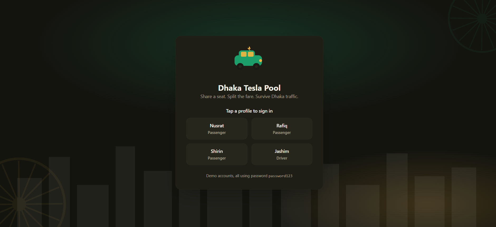
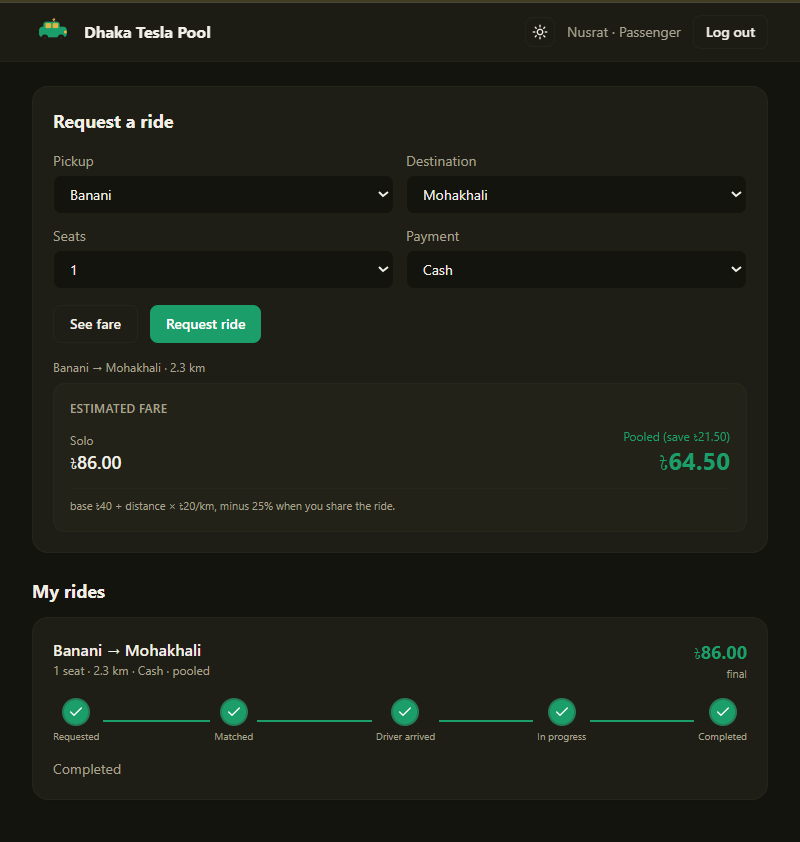
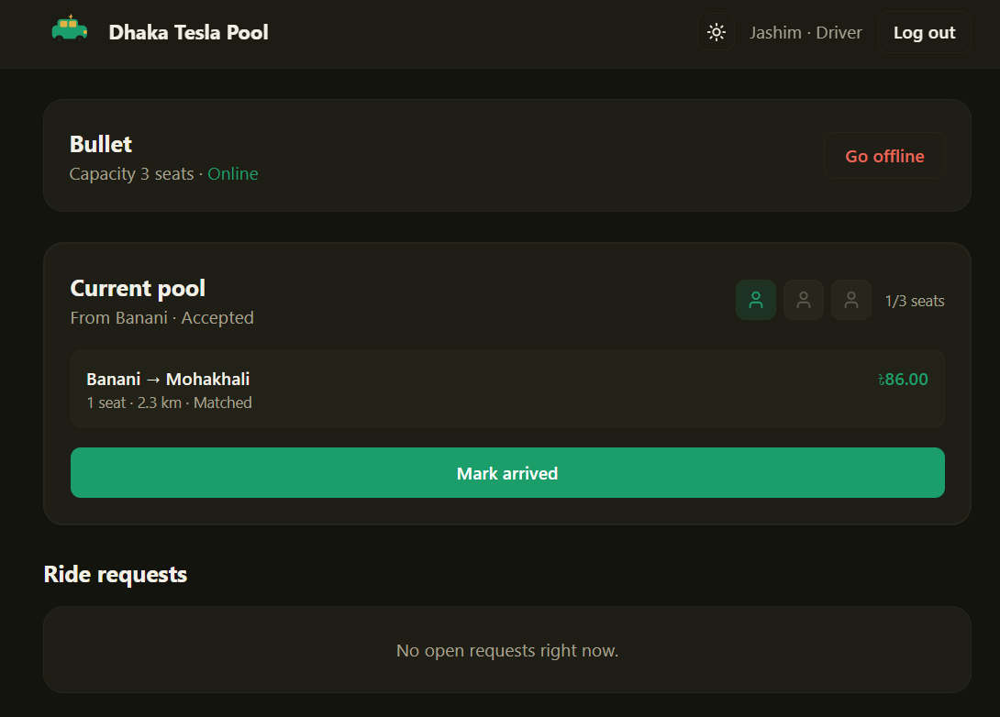
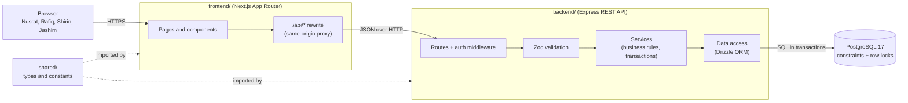
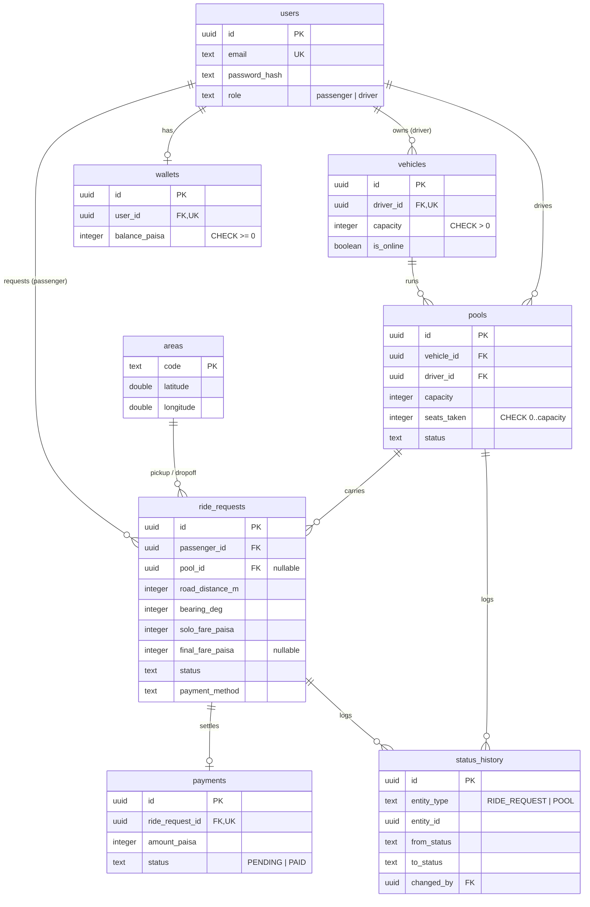

<div align="center">

# 🛺 Dhaka Tesla Pool

### Share a seat. Split the fare. Survive Dhaka traffic.

A ride-pooling MVP where passengers heading the same way share one driver's
three-seat "Tesla", split the fare fairly, and every rider sees only their own
trip — built for the RoBenDevs Software Engineer Intern take-home.

[](https://github.com/ShArafat58/dhaka-tesla-pool/actions/workflows/ci.yml)


**[🔗 Live demo](https://dhaka-tesla-pool-frontend.vercel.app)** ·
**[🎥 Demo video](#-demo-video)** ·
**[📖 Docs](./docs)**

</div>

---

## 🚀 Try it live (no setup needed)

Open **[dhaka-tesla-pool-frontend.vercel.app](https://dhaka-tesla-pool-frontend.vercel.app)**
and tap a profile to sign in — no typing needed.

**1.** Tap **Nusrat** to sign in as a passenger, then request a ride:
Banani → Mohakhali → **Request ride**.

**2.** To act as the driver at the same time, open the **same link in an incognito
window** and tap **Jashim**. Go online, then **Accept** the request.

**3.** Switch back to Nusrat's window — her status moves from Requested → Matched
→ Driver arrived → In progress → Completed on its own (live polling), and the
fare finalises.

**4.** For pooling: request a second ride as **Rafiq** (Banani → Gulshan 1) while
Jashim's pool is open, and tap **Join pool** — two riders now share Bullet.

> ⏳ The API runs on a free Render instance that sleeps when idle, so the **first**
> request may take 30–50 seconds to wake up. Every request after that is instant.

**Demo accounts** — all use password `password123`:

| Name   | Role      | Story                                  |
| ------ | --------- | -------------------------------------- |
| Jashim | Driver    | Owns **Bullet**, a 3-seat Tesla        |
| Nusrat | Passenger | Banani → Mohakhali                     |
| Rafiq  | Passenger | Banani → Gulshan 1 (pools with Nusrat) |
| Shirin | Passenger | Races Nusrat for the last seat         |

Prefer to run it yourself? Jump to [Local setup](#-local-setup) or
[Run with Docker](#-run-everything-with-docker).

---

## 🎯 The problem

Nusrat wants to get from Banani to Mohakhali. Two minutes later Rafiq books almost
the same route to Gulshan 1. Jashim's Bullet has three seats. The app has to
decide, in about a second, whether these two can share a seat, split the fare
fairly, and finish a ten-minute ride without any of it getting weird — while
Shirin tries to grab the last seat thirty seconds later.

This MVP models that story with three actors — **Passenger**, **Driver/Tesla**,
and **Ride/Pool** — and focuses on the engineering that actually matters: correct
pooling, fair per-passenger fares, a clear ride lifecycle, and never letting two
riders claim the same seat.

## ✨ Features

**Passenger**

- Sign in, request a ride (pickup, destination, seats, payment method)
- See a live fare estimate with a transparent formula breakdown
- Track status on a live timeline: Requested → Matched → Driver arrived → In
  progress → Completed
- Join a compatible open pool with one tap
- View ride history; cancel any ride before it starts

**Driver**

- Sign in, go online / offline
- Owns one Tesla with a fixed seat capacity
- See open ride requests, accept one to start a pool
- Mark arrived, start and complete the trip
- See every passenger in the pool with a seat-occupancy visual

**Pool & fairness**

- Multiple compatible requests share one Tesla; occupied seats never exceed
  capacity
- Each passenger pays their own fare and sees only their own status
- Full status history is kept for every ride and pool (audit trail)
- Cash or a simulated **TeslaPay** wallet

## 📸 Screenshots

<div align="center">

|                   Sign in                    |                      Passenger                       |                   Driver                    |
| :------------------------------------------: | :--------------------------------------------------: | :-----------------------------------------: |
|             |             |          |
| Tap-a-profile sign in with the Bullet mascot | Request a ride, live fare breakdown, status timeline | Online toggle, pool card and seat occupancy |

</div>

## 🏗️ Architecture

A small, deliberate monolith: one Next.js frontend, one Node.js REST API, one
PostgreSQL database. No queues, caches or microservices — an MVP with a handful
of drivers does not need them (see [scaling](#-if-oi-tesla-goes-viral) for when
that changes).



Routes never touch the database directly, and services never know about HTTP.
That keeps the business rules testable without a web server. Full details in
[docs/architecture.md](./docs/architecture.md).

## 🗄️ Database (ERD)

Eight tables. `users` and `vehicles` are the actors, `areas` is fixed reference
data, `pools` group the `ride_requests` that share a Tesla, `payments` records
money, and `status_history` is the audit trail for both state machines.



Every table, constraint and index is explained in
[docs/data-model.md](./docs/data-model.md).

## 🧰 Tech stack & why

For every non-mandated choice, here is what we picked, the realistic
alternatives, and when we would switch.

| Concern      | Choice                                | Why it fits this MVP                                                    | When we'd switch                            |
| ------------ | ------------------------------------- | ----------------------------------------------------------------------- | ------------------------------------------- |
| Database     | PostgreSQL 17                         | Seats and money need transactions, row locks and CHECK constraints      | Read replicas / PostGIS at scale            |
| ORM          | Drizzle                               | SQL-shaped API; `FOR UPDATE` and CHECK constraints are first-class      | Raw SQL for hot paths if queries outgrow it |
| Backend      | Express 5                             | Minimal, widely known; v5 forwards async errors to one handler          | Fastify for throughput, NestJS for scale    |
| Validation   | Zod                                   | One schema gives runtime checks + TypeScript types, shared with the web | —                                           |
| Auth         | JWT in an httpOnly cookie, bcrypt     | No extra infra; cookie is not readable by page scripts                  | Server sessions / refresh tokens            |
| Frontend     | Next.js 16 (App Router)               | File routing, layouts, a built-in rewrite proxy for same-origin cookies | —                                           |
| Server state | TanStack Query                        | Caching, polling and loading/error states out of the box                | —                                           |
| Live updates | Polling every 4s                      | Stateless and simple; a few seconds of delay is fine for ride status    | SSE / WebSocket when polling load grows     |
| Tests        | Vitest + a real Postgres              | The concurrency test only means something against a real database       | —                                           |
| Hosting      | Vercel (web), Render (API), Neon (DB) | All free-tier, no credit card                                           | Paid tier to remove cold starts             |

REST over GraphQL: the domain is a small set of resources with clear actions
(`POST /ride-requests`, `POST /pools/:id/start`), easy to test and read in logs.

## 💰 Fare model & pooling

Fares are simple and hand-checkable. Money is stored as **integer paisa**
everywhere (100 paisa = ৳1); we format to taka only for display.

distanceCharge = roadDistanceKm × ৳20
subtotal = (৳40 base + distanceCharge) × seats
poolDiscount = 25% of subtotal, only when the pool has 2+ passengers
passengerFare = subtotal − poolDiscount

**Worked example — Nusrat & Rafiq pooled in Bullet:**

| Passenger | Trip               | Distance | Solo fare | Pooled fare (−25%) |
| --------- | ------------------ | -------- | --------- | ------------------ |
| Nusrat    | Banani → Mohakhali | 2.3 km   | ৳86.00    | **৳64.50**         |
| Rafiq     | Banani → Gulshan 1 | 2.5 km   | ৳90.00    | **৳67.50**         |

**Why integer paisa?** Floating point can't represent values like 0.1 exactly,
so money drifts (`0.1 + 0.2 = 0.30000000000000004`). Integers are exact and map
directly to a Postgres `integer`.

**Matching rule:** two requests may share a Tesla if they have the **same pickup
area** and their travel directions are within **60°** of each other (measured as
a compass bearing). Nusrat (192°) and Rafiq (140°) differ by 52° → they pool. A
rider to Uttara (345°) is 153° away → separate ride.

Full derivation, all area coordinates and more examples:
[docs/domain-rules.md](./docs/domain-rules.md).

## 🔄 Ride lifecycle

Two linked state machines so one passenger cancelling never breaks the trip for
everyone else:

- **Ride request:** `REQUESTED → MATCHED → DRIVER_ARRIVED → STARTED → COMPLETED`
  (or `CANCELLED` before it starts)
- **Pool:** `FORMING → ACCEPTED → ARRIVED → IN_PROGRESS → COMPLETED` (or `CANCELLED`)

Valid transitions live in one table in the service layer; any invalid jump (e.g.
`REQUESTED → STARTED`) is rejected. Every change is written to `status_history`.
Diagrams and the full transition table: [docs/lifecycle.md](./docs/lifecycle.md).

## ⚡ Concurrency: the last-seat problem

Bullet has one seat left. Nusrat and Shirin both tap "Join" at the same instant,
and both initially see one seat free. Exactly one must win. We use **three layers**:

1. **Row lock** — `SELECT ... FOR UPDATE` on the pool row, so the second request
   waits for the first to commit instead of both reading "one seat free".
2. **Application check** — under the lock, `seatsTaken + seats <= capacity`.
3. **Database CHECK** — `CHECK (seats_taken <= capacity)` as the final backstop,
   independent of the application code.

A real parallel test fires two joins with `Promise.allSettled` against a real
Postgres and asserts exactly one wins, repeated five times so the result is a
guarantee, not luck. Full write-up and what changes at scale:
[docs/concurrency.md](./docs/concurrency.md).

## 🧪 Testing

41 tests run against a **real PostgreSQL** (mocking would make the concurrency
test meaningless). They cover exactly the risky behaviour:

- Bullet's capacity can never be exceeded (incl. two concurrent requests)
- Invalid state transitions are rejected
- Nusrat's and Rafiq's pooled fares calculate correctly
- A user cannot read or modify another user's ride
- Cancellation rules hold (allowed before start, rejected after)
- TeslaPay never lets a wallet go negative; low balance rolls the trip back

```bash
pnpm test        # all suites
```

## 📦 Project structure

```
dhaka-tesla-pool/
├── backend/            # Express REST API
│   ├── src/
│   │   ├── config/     # env validation
│   │   ├── db/         # Drizzle schema, migrations, seed, client
│   │   ├── lib/        # geo, matching, fare-adjacent helpers, errors, auth
│   │   ├── middleware/ # auth, validation, error handler
│   │   ├── routes/     # auth, rides, driver, health
│   │   ├── services/   # business logic (ride, driver, pool, payment, auth)
│   │   └── test/       # test setup + factories
│   └── Dockerfile
├── frontend/           # Next.js 16 App Router
│   ├── app/            # login, rides, driver pages
│   ├── components/     # header, timeline, seat indicator, fare card, ...
│   └── lib/            # api client, auth/theme/toast context, formatters
├── shared/             # types, enums, area data, fare model (used by both)
├── docs/               # architecture, data-model, lifecycle, domain-rules,
│                       # assumptions, concurrency
├── docker-compose.yml  # Postgres + API
└── .github/workflows/  # CI: lint, format, typecheck, test on real Postgres
```

## ✅ Prerequisites

- **Node.js 24+** and **pnpm 10+**
- **Docker Desktop** (for the database and one-command setup)
- **Git**

## 🐳 Run everything with Docker

The fastest way to get the backend + database running with migrations and seed
data applied automatically:

```bash
git clone https://github.com/ShArafat58/dhaka-tesla-pool.git
cd dhaka-tesla-pool
cp .env.example .env
docker compose up -d --build
```

`docker compose up` starts PostgreSQL, waits until it is healthy, then the API
container **applies migrations, seeds the story cast, and serves on port 4000**.

```bash
curl http://localhost:4000/health          # {"status":"ok",...}
docker compose ps                          # both containers healthy
```

Then start the frontend (see below) and open http://localhost:3000.

> If port 5432 is already used on your machine, the compose file maps Postgres to
> host port **55432** by default. Change `POSTGRES_PORT` in `.env` if needed.

## 🔧 Local setup (without Docker for the app)

```bash
pnpm install

# 1. Start the database (Docker) and copy env files
docker compose up -d db
cp .env.example .env
cp backend/.env.example backend/.env

# 2. Run migrations and seed the story cast
pnpm --filter @dtp/api db:migrate
pnpm --filter @dtp/api db:seed

# 3. Run the backend (http://localhost:4000)
pnpm --filter @dtp/api dev

# 4. In another terminal, run the frontend (http://localhost:3000)
pnpm --filter @dtp/web dev
```

**Useful commands:**

```bash
pnpm lint            # ESLint across the repo
pnpm format          # Prettier
pnpm typecheck       # TypeScript, all packages
pnpm test            # Vitest against a real Postgres
```

## 🔑 Environment variables

Never commit real secrets — only `.env.example` files are tracked.

| Variable            | Where          | Purpose                                    |
| ------------------- | -------------- | ------------------------------------------ |
| `POSTGRES_USER`     | root `.env`    | Database user (docker compose)             |
| `POSTGRES_PASSWORD` | root `.env`    | Database password                          |
| `POSTGRES_DB`       | root `.env`    | Database name                              |
| `POSTGRES_PORT`     | root `.env`    | Host port for Postgres (default 55432)     |
| `DATABASE_URL`      | `backend/.env` | Postgres connection string                 |
| `JWT_SECRET`        | `backend/.env` | Secret for signing auth tokens (16+ chars) |
| `COOKIE_SECURE`     | `backend/.env` | `true` only over HTTPS                     |
| `CORS_ORIGIN`       | `backend/.env` | Allowed frontend origin                    |
| `API_URL`           | frontend       | Backend URL the `/api/*` proxy forwards to |

## 🌐 API overview

All routes are under the API base URL. Auth is a JWT in an httpOnly cookie.

| Method | Route                        | Who       | Purpose                         |
| ------ | ---------------------------- | --------- | ------------------------------- |
| POST   | `/auth/signup`               | public    | Create an account               |
| POST   | `/auth/signin`               | public    | Sign in, set cookie             |
| POST   | `/auth/logout`               | any       | Clear cookie                    |
| GET    | `/auth/me`                   | any       | Current user                    |
| POST   | `/rides/estimate`            | passenger | Fare estimate (solo & pooled)   |
| POST   | `/rides`                     | passenger | Create a ride request           |
| GET    | `/rides`                     | passenger | My ride history                 |
| GET    | `/rides/:id/pools`           | passenger | Joinable pools for a ride       |
| POST   | `/rides/join`                | passenger | Join a pool (concurrency-safe)  |
| POST   | `/rides/:id/cancel`          | passenger | Cancel before the trip starts   |
| GET    | `/driver/vehicle`            | driver    | My Tesla                        |
| PATCH  | `/driver/online`             | driver    | Go online / offline             |
| GET    | `/driver/requests`           | driver    | Open ride requests              |
| GET    | `/driver/pool`               | driver    | My active pool + passengers     |
| POST   | `/driver/rides/:id/accept`   | driver    | Accept a ride, start a pool     |
| POST   | `/driver/pools/:id/arrive`   | driver    | Mark arrived                    |
| POST   | `/driver/pools/:id/start`    | driver    | Start the trip (fares finalise) |
| POST   | `/driver/pools/:id/complete` | driver    | Complete the trip (settle pay)  |
| GET    | `/health`                    | public    | Health check + DB ping          |

## 🚢 Deployment

| Layer    | Platform | Notes                          |
| -------- | -------- | ------------------------------ |
| Frontend | Vercel   | Next.js, free tier             |
| API      | Render   | Docker web service, free tier  |
| Database | Neon     | Serverless Postgres, free tier |

All three are free with no credit card. The frontend proxies `/api/*` to the API
so the browser sees one origin and the auth cookie works.

**Known limitation:** the free Render instance sleeps after inactivity, so the
first request after a while takes 30–50 seconds to wake. Subsequent requests are
instant. A paid instance removes this; for the MVP the trade-off is acceptable.

## 🧭 Key decisions & trade-offs

- **Two state machines (ride + pool)** instead of one, so a single passenger
  cancelling doesn't end the trip for everyone else.
- **Fare finalised at trip start**, not at request time — the pooled discount
  only applies if the pool actually has 2+ riders when the trip begins.
- **Enums as `text` + CHECK**, not Postgres `ENUM` types, so adding a value is a
  plain migration instead of an `ALTER TYPE`.
- **Polling over WebSockets** for live status — simpler and stateless; a few
  seconds of delay is fine for ride status.
- **Concurrency via DB row locks + CHECK**, not application-only logic, because
  the guarantee must live where the data lives.

## ⚠️ Known limitations

- One active pool per driver at a time (keeps the demo clear).
- Live updates poll every 4 seconds rather than pushing instantly.
- No password reset / email verification (demo accounts only).
- Render cold starts (see Deployment).

## 🔮 Next improvements

- Real-time updates via Server-Sent Events or WebSockets.
- Multiple concurrent pools per driver and smarter auto-matching.
- Idempotency keys on write endpoints for safe client retries.
- Ratings, refunds, and a fuller payment flow.

## 📋 Assumptions

The brief leaves some things open on purpose. Every assumption is documented,
applied consistently across schema, API, tests and UI, and listed with its
rationale in **[docs/assumptions.md](./docs/assumptions.md)** — for example: areas
are fixed reference data, road distance = straight-line × 1.3, a driver owns one
Tesla, and roles are fixed at signup.

## 🤖 AI Usage

AI tools were used as normal engineering assistants, and every line is understood
and defensible.

- **Tools:** Claude (architecture, code review, docs, debugging) and the
  Antigravity IDE (in-editor assistance).
- **What for:** scaffolding boilerplate, drafting the schema and services,
  writing tests, and structuring these docs — always reviewed and adjusted by
  hand.
- **One accepted suggestion:** using `SELECT ... FOR UPDATE` plus a database
  `CHECK` constraint (not application-only checks) for the last-seat race. It puts
  the guarantee in the database, so it holds even under real parallel requests —
  proven by the concurrency test.
- **One rejected / changed suggestion:** an early idea used a single status field
  shared by ride and pool. It was rejected because one passenger cancelling would
  then corrupt the whole trip; it was replaced with two linked state machines.

## 🎥 Demo video

**[▶️ Watch the 6-minute walkthrough](https://youtu.be/T3vepbKmVjg)**

A quick tour of the problem, the architecture and database, and a live product
demo — passenger flow, driver flow, pooling, and the last-seat concurrency case.

## 🌆 If Oi Tesla Goes Viral

Scaling the MVP to **1M passengers / 100k drivers** — reasoning, not box-count.

- **Load balancing & horizontal scaling:** the API is stateless (JWT in a
  cookie), so put many instances behind a load balancer. No app-server state to
  share.
- **Database:** promote to a managed Postgres with a primary for writes and
  **read replicas** for history/list queries. Index `ride_requests(status)`,
  `pools(driver_id, status)`, `status_history(entity_type, entity_id)` (already
  present).
- **DB contention:** the last-seat row lock serialises joiners on one hot pool.
  At scale, switch to an **atomic conditional UPDATE**
  (`UPDATE ... WHERE seats_taken + n <= capacity`) and treat "0 rows updated" as
  "no seats" — no held lock.
- **Geospatial matching:** replace fixed areas with **PostGIS** and a spatial
  index for real "nearby driver" search.
- **Caching:** cache read-heavy, slow-changing data (areas, a driver's open
  requests) in Redis; keep seats and money in Postgres only.
- **Queues / events:** move side effects (notifications, receipts, analytics)
  onto an event stream so the request path stays fast.
- **Real-time:** replace polling with WebSockets/SSE via a pub/sub layer.
- **Rate limiting & idempotency:** per-user rate limits at the edge; idempotency
  keys so a retried "join" or "pay" can't double-book or double-charge.
- **Observability:** structured logs (already via pino), plus metrics and tracing
  to find contention and slow queries.
- **Deployment:** blue-green or rolling deploys; the DB stays the single source
  of truth for seats and money.

The guiding rule: **add complexity only when a real bottleneck demands it.** The
MVP deliberately has none of the above, because a few drivers don't need it.

---

<div align="center">

Built with care for the RoBenDevs take-home by **Shahriar Hossain Arafat**.
Cast: Jashim, Bullet, Nusrat, Rafiq & Shirin. 🛺

</div>
