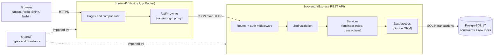

# Architecture

Dhaka Tesla Pool is a small monolith: one Next.js frontend, one Node.js REST API and one
PostgreSQL database. Everything runs with `docker compose up`. There are no queues, caches or
microservices, because an MVP with a handful of drivers does not need them (see the scaling
section of the README for when that changes).

## System diagram

## Layers and responsibilities

| Layer          | Folder                 | Responsibility                                                                     |
| -------------- | ---------------------- | ---------------------------------------------------------------------------------- |
| UI             | `frontend/`            | Screens for passengers and drivers, loading/error/empty states, polling for status |
| Proxy          | `frontend/` (rewrites) | Forwards `/api/*` to the backend so the auth cookie stays same-origin              |
| Routes         | `backend/src/routes`   | HTTP concerns only: parse request, call a service, shape the response              |
| Validation     | `backend/src/schemas`  | Zod schemas reject bad input before it reaches business logic                      |
| Services       | `backend/src/services` | All business rules: matching, fares, state transitions, capacity, authorization    |
| Data access    | `backend/src/db`       | Drizzle schema, migrations, seed and queries                                       |
| Database       | PostgreSQL             | Last line of defence: FKs, CHECK, UNIQUE and partial unique indexes                |
| Shared package | `shared/`              | Status enums, area codes and API types used by both sides                          |

Rule of thumb: routes never talk to the database directly, and services never know about HTTP.
That keeps the business rules testable without a web server.

## Why REST

The domain is a small set of resources (users, ride requests, pools) with clear actions.
REST maps to it directly (`POST /ride-requests`, `POST /pools/:id/start`), works with plain
`fetch`, is easy to test with Supertest and easy to read in logs. GraphQL would add a schema
layer and resolver complexity without a real benefit for a few fixed screens.

## Key technology choices

| Concern      | Choice                                    | Realistic alternatives           | Why it fits this MVP                                                                                               | When we would switch                                           |
| ------------ | ----------------------------------------- | -------------------------------- | ------------------------------------------------------------------------------------------------------------------ | -------------------------------------------------------------- |
| Database     | PostgreSQL 17                             | MySQL, SQLite, MongoDB           | Seats and money need transactions, row locks (`FOR UPDATE`), CHECK constraints and partial unique indexes          | Add read replicas or PostGIS at scale; the engine stays        |
| ORM          | Drizzle                                   | Prisma, Knex, raw SQL            | SQL-shaped API, supports `FOR UPDATE` and CHECK constraints directly, plain SQL migrations we can read and explain | Raw SQL for hot paths if query shapes outgrow the builder      |
| Backend      | Express 5                                 | Fastify, NestJS                  | Minimal and widely known; v5 forwards async errors to one error handler                                            | Fastify for raw throughput, NestJS when many teams share code  |
| Validation   | Zod                                       | Joi, class-validator             | One schema gives runtime checks and TypeScript types; can be shared with the frontend                              | —                                                              |
| Auth         | JWT in an httpOnly cookie, bcrypt hashing | Server sessions, NextAuth, Auth0 | No extra infrastructure; httpOnly cookie is not readable by page scripts                                           | Server-side sessions or refresh tokens when revocation matters |
| Frontend     | Next.js (App Router)                      | Vite + React Router              | File-based routing, layouts and a built-in rewrite proxy                                                           | —                                                              |
| Server state | TanStack Query                            | SWR, `useEffect` + `fetch`       | Caching, polling and loading/error states out of the box                                                           | —                                                              |
| Live status  | Polling every few seconds                 | WebSocket, Server-Sent Events    | Stateless and simple; a few seconds of delay is acceptable for ride status                                         | SSE or WebSocket when polling load becomes significant         |
| Tests        | Vitest + Supertest on a real Postgres     | Jest, mocked database            | The concurrency test only means something against a real database                                                  | —                                                              |
| Logging      | pino (JSON to stdout)                     | winston, console                 | Structured, fast, works with any log collector                                                                     | —                                                              |
| Hosting      | Vercel (web), Render (API), Neon (DB)     | Railway, Fly.io, a single VPS    | All have free tiers without a credit card                                                                          | Paid tier to remove cold starts                                |

Design details live in:

- [Domain rules](./domain-rules.md): areas, distance, matching rule and fare model
- [Lifecycle](./lifecycle.md): ride request and pool state machines
- [Data model](./data-model.md): ERD and table design
- [Assumptions](./assumptions.md)
