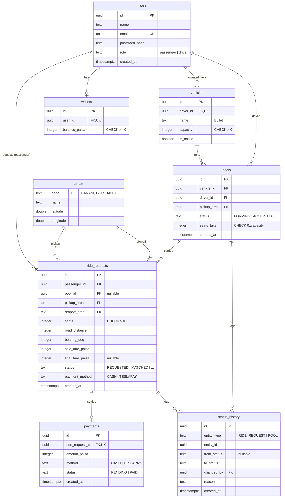

# Data model

Eight tables. `users` and `vehicles` are the actors, `areas` is fixed reference data, `pools`
group `ride_requests` that share a Tesla, `payments` records money, and `status_history` is the
audit trail for both machines.

## ERD

## Tables

### `users`

Both passengers and drivers. `role` separates them. `email` is `UNIQUE`; `password_hash` stores a
bcrypt hash, never a plain password.

### `wallets`

One row per user for the simulated TeslaPay balance. `balance_paisa` has `CHECK (>= 0)` so a
deduction can never drive it negative, even under a race. `user_id` is `UNIQUE` (one wallet each).

### `areas`

Fixed reference data seeded from the area list in [domain rules](./domain-rules.md). `code` is the
primary key so ride requests store a stable code, not a coordinate that might drift.

### `vehicles`

One Tesla per driver (`driver_id` is `UNIQUE`). `capacity` is fixed per vehicle with `CHECK (> 0)`
(Bullet = 3). `is_online` drives whether the driver sees requests.

### `pools`

One Tesla trip. `seats_taken` is kept in sync as passengers join and leave, guarded by
`CHECK (seats_taken >= 0 AND seats_taken <= capacity of the vehicle)` — enforced with a trigger or
an application-level check plus the ride-request seat sum. This is the last line of defence for the
concurrency problem: even if two requests race, the row lock plus this check let only one win.

### `ride_requests`

The heart of the model. Stores the passenger's own trip, the frozen distance and bearing (so the
fare is reproducible), both fares (`solo_fare_paisa` always, `final_fare_paisa` once the trip
starts), and its own status. `pool_id` is nullable because a request exists briefly before it
joins a pool.

### `payments`

One row per ride request (`ride_request_id` is `UNIQUE`). Records the amount actually charged and
whether it is `PENDING` or `PAID`. Kept separate from `ride_requests` so payment can be extended
(refunds, retries) without touching the ride.

### `status_history`

Append-only audit log for **both** machines (`entity_type` = `RIDE_REQUEST` or `POOL`). Every
transition writes one row: `from_status`, `to_status`, `changed_by`, `reason`, `created_at`. This
is how any ride can be explained later.

## Indexes

| Index                                    | Why                                     |
| ---------------------------------------- | --------------------------------------- |
| `users(email)` UNIQUE                    | Login lookup and duplicate-signup guard |
| `vehicles(driver_id)` UNIQUE             | One Tesla per driver                    |
| `wallets(user_id)` UNIQUE                | One wallet per user                     |
| `ride_requests(passenger_id)`            | "My rides" history query                |
| `ride_requests(pool_id)`                 | List all passengers in a pool           |
| `ride_requests(status)`                  | Find open `REQUESTED` requests to match |
| `pools(driver_id, status)`               | Driver's active pool lookup             |
| `status_history(entity_type, entity_id)` | Replay one entity's history in order    |
| `payments(ride_request_id)` UNIQUE       | One payment per ride                    |

## Types

- Identifiers: `uuid` (generated by the database), so ids are not guessable sequential integers.
- Money: `integer` paisa with `CHECK (>= 0)` where a balance is involved.
- Enums (`role`, `status`, `payment_method`): stored as `text` with a `CHECK` list rather than a
  Postgres `ENUM` type, so adding a value is a plain migration, not an `ALTER TYPE`.
- Timestamps: `timestamptz` (UTC), formatted to Dhaka time only in the UI.
