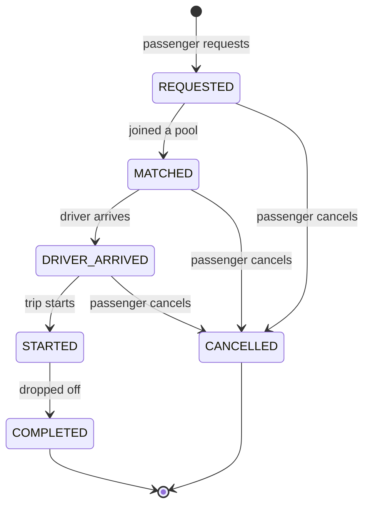
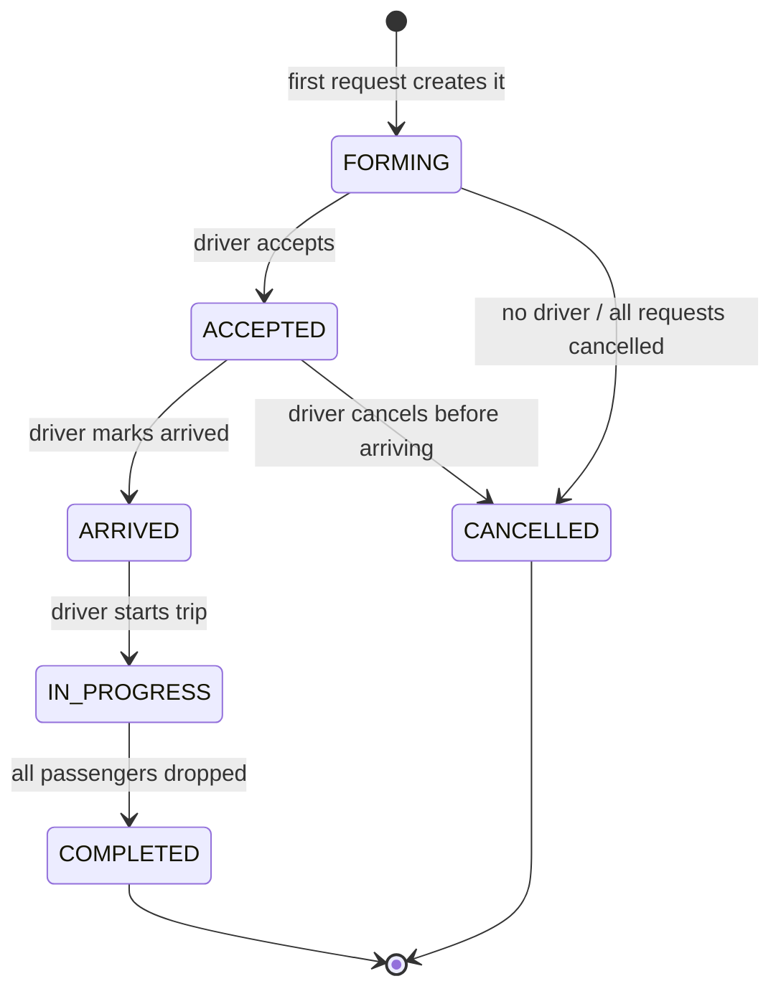

# Ride and pool lifecycle

The product has two related state machines. A **ride request** is one passenger's journey. A
**pool** is one Tesla trip that carries one or more ride requests. Keeping them separate means
one passenger cancelling does not break the trip for everyone else in the car.

Every state change is written to `status_history` (who changed it, from what, to what, when, and
why), so any ride can be explained after the fact.

## Ride request states

| State            | Meaning                                     | Passenger can cancel? |
| ---------------- | ------------------------------------------- | --------------------- |
| `REQUESTED`      | Created, not yet in a pool                  | Yes                   |
| `MATCHED`        | In a pool, driver assigned, not yet arrived | Yes                   |
| `DRIVER_ARRIVED` | Driver is at the pickup point               | Yes                   |
| `STARTED`        | Trip is in progress                         | No                    |
| `COMPLETED`      | Passenger dropped off, fare charged         | No (terminal)         |
| `CANCELLED`      | Cancelled before the trip started           | No (terminal)         |

**Cancellation rule:** a passenger may cancel only before `STARTED`. Once the trip is moving, the
ride must complete. `COMPLETED` and `CANCELLED` are terminal; nothing leaves them.

## Pool states

| State         | Meaning                                                 | New riders may join? |
| ------------- | ------------------------------------------------------- | -------------------- |
| `FORMING`     | Exists, waiting for a driver to accept                  | Yes                  |
| `ACCEPTED`    | A driver owns it; still gathering compatible passengers | Yes                  |
| `ARRIVED`     | Driver is at the pickup point                           | No                   |
| `IN_PROGRESS` | Trip is moving                                          | No                   |
| `COMPLETED`   | Trip finished                                           | No (terminal)        |
| `CANCELLED`   | Trip abandoned before it started                        | No (terminal)        |

New requests may join only while the pool is `ACCEPTED` (matching rule condition 3). After
`ARRIVED` the seat count is frozen.

## How the two machines move together

| Driver action | Pool change               | Effect on each ride request in the pool |
| ------------- | ------------------------- | --------------------------------------- |
| Accept        | `FORMING → ACCEPTED`      | `REQUESTED → MATCHED`                   |
| Mark arrived  | `ACCEPTED → ARRIVED`      | `MATCHED → DRIVER_ARRIVED`              |
| Start trip    | `ARRIVED → IN_PROGRESS`   | `DRIVER_ARRIVED → STARTED` (fare fixed) |
| Complete trip | `IN_PROGRESS → COMPLETED` | `STARTED → COMPLETED` (fare charged)    |

A passenger cancelling frees their seats. If the **last** active request in a pool cancels while
the pool is still `FORMING` or `ACCEPTED`, the pool goes to `CANCELLED`.

## Enforcement

Valid transitions live in one table in the service layer. Any request for a transition not in
that table is rejected with a clear error, so an invalid jump (for example `REQUESTED → STARTED`)
can never happen through the API. This is exactly what the "invalid state transition" test checks.
